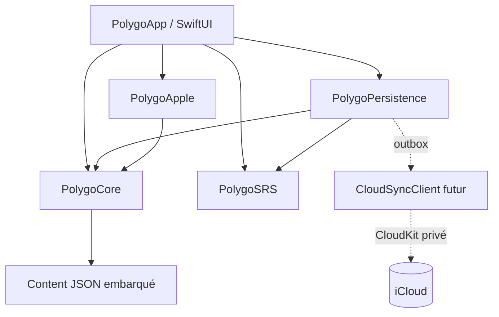

# Architecture technique

Ce document est le contrat entre le contenu, le domaine, l’interface SwiftUI et
les adaptateurs Apple. Il privilégie des types `Codable`, `Hashable` et `Sendable`
afin que le moteur soit testable sur Linux et que les décisions d’interface ne
se retrouvent pas dans les écrans.

## Vue d’ensemble



Le sens des dépendances est imposé :

```text
PolygoCore        Foundation uniquement
PolygoSRS         PolygoCore + Foundation (algorithme seul)
PolygoPersistence PolygoCore + PolygoSRS + Foundation
PolygoApple       PolygoCore + AVFoundation/Speech/PencilKit/Vision
PolygoApp         PolygoCore + PolygoSRS + PolygoPersistence + PolygoApple + SwiftUI
```

Le nom des targets et des produits doit rester celui-ci pour permettre à la CI et
aux agents de travailler en parallèle. Le package partagé peut être organisé à
la racine (`Package.swift`, `Sources/PolygoCore`, etc.) ; `PolygoApp` et
`PolygoApple` sont des targets Apple décrites dans `project.yml` XcodeGen.

## Contrats du noyau (`PolygoCore`)

### IDs et texte localisé

Les IDs sont opaques et stables dans le contenu. Ils ne sont jamais dérivés d’un
index de tableau. La définition suivante est le modèle de référence ; les types
`CourseID`, `ModuleID`, `LessonID`, `BlockID`, `ExerciseID`, `VocabularyID`,
`CardID`, `AssetID`, `ProfileID`, `EventID`, `DeviceID`, `RecordingID`,
`DrawingID`, `ObjectiveID` et `StoryID` ont tous le même contrat
`RawRepresentable` avec un `String` non vide.

```swift
public enum DomainError: Error, Sendable {
    case invalidIdentifier(String)
    case emptyLocalizedText
    case invalidScore(Double)
    case eventProfileMismatch
}

public protocol PolygoIdentifier:
    RawRepresentable, Codable, Hashable, Sendable where RawValue == String {}

public extension PolygoIdentifier {
    init(from decoder: Decoder) throws {
        let container = try decoder.singleValueContainer()
        let raw = try container.decode(String.self)
        guard let value = Self(rawValue: raw) else {
            throw DomainError.invalidIdentifier(raw)
        }
        self = value
    }

    func encode(to encoder: Encoder) throws {
        var container = encoder.singleValueContainer()
        try container.encode(rawValue)
    }
}

public struct CourseID: PolygoIdentifier {
    public let rawValue: String
    public init?(rawValue: String) {
        guard !rawValue.isEmpty, rawValue.count <= 128 else {
            return nil
        }
        self.rawValue = rawValue
    }
}

public struct LocalizedText: Codable, Hashable, Sendable {
    public let values: [String: String] // ex. ["fr": "Bonjour", "zh-Hans": "你好"]

    public init(values: [String: String]) throws {
        guard !values.isEmpty, values.values.allSatisfy({ !$0.isEmpty }) else {
            throw DomainError.emptyLocalizedText
        }
        self.values = values
    }

    public func resolve(preferred: [String], fallback: String = "en") -> String? {
        for language in preferred {
            if let value = values[language] { return value }
            if let key = values.keys.sorted().first(where: { $0.hasPrefix(language + "-") }),
               let value = values[key] {
                return value
            }
        }
        return values[fallback] ?? values.values.first
    }
}
```

Dans les extraits suivants, les autres structs d’ID ont les mêmes propriétés et
initialiseurs que `CourseID`. Un `typealias` vers `String` est interdit dans le
code réel : il permettrait de passer par erreur un `LessonID` à la place d’un
`ExerciseID`.

### Cours, modules, leçons et parcours

Un cours est un catalogue ; une leçon est un document séparé afin de charger
uniquement ce qui est nécessaire au parcours courant.

```swift
public struct CourseManifest: Codable, Hashable, Sendable {
    public let schemaVersion: Int
    public let contentVersion: String
    public let id: CourseID
    public let slug: String
    public let title: LocalizedText
    public let description: LocalizedText
    public let alignment: [CurriculumTag] // ex. HSK 1 et CEFR A1
    public let modules: [ModuleSummary]
}

public struct ModuleSummary: Codable, Hashable, Sendable {
    public let id: ModuleID
    public let order: Int
    public let title: LocalizedText
    public let lessonIDs: [LessonID]
}

public struct LessonDocument: Codable, Hashable, Sendable {
    public let schemaVersion: Int
    public let contentVersion: String
    public let id: LessonID
    public let moduleID: ModuleID
    public let order: Int
    public let title: LocalizedText
    public let summary: LocalizedText
    public let estimatedMinutes: Int
    public let objectives: [LearningObjective]
    public let vocabulary: [VocabularyEntry]
    public let blocks: [LessonBlock]
    public let cards: [ReviewCard]
}

public struct LearningObjective: Codable, Hashable, Sendable {
    public let id: String
    public let statement: LocalizedText
    public let required: Bool
}

public struct CurriculumTag: Codable, Hashable, Sendable {
    public let framework: String // "HSK", "CEFR", ou une taxonomie propre
    public let level: String
}

public struct VocabularyEntry: Codable, Hashable, Sendable {
    public let id: VocabularyID
    public let hanzi: String // forme simplifiée canonique
    public let traditionalHanzi: String?
    public let pinyin: String // diacritiques, ex. nǐ hǎo
    public let toneNumbers: [Int] // 1...5, 0 pour ton neutre si connu
    public let segmentation: [TextSegment]
    public let partOfSpeech: PartOfSpeech?
    public let grammarNotes: [GrammarNote]
    public let meaning: LocalizedText
    public let audio: AssetReference?
    public let example: ExampleSentence?
    public let memoryStory: LocalizedText?
}

public enum ChineseScript: String, Codable, Hashable, Sendable {
    case simplified
    case traditional
}

public struct TextSegment: Codable, Hashable, Sendable {
    public let surface: String
    public let vocabularyID: VocabularyID?
    public let pinyin: String?
    public let partOfSpeech: PartOfSpeech?
}

public enum PartOfSpeech: String, Codable, Hashable, Sendable {
    case noun, verb, adjective, adverb, pronoun, classifier
    case preposition, conjunction, particle, measureWord, interjection, other
}

public struct GrammarNote: Codable, Hashable, Sendable {
    public let pattern: String
    public let explanation: LocalizedText
    public let examples: [ExampleSentence]
}

public struct ExampleSentence: Codable, Hashable, Sendable {
    public let hanzi: String
    public let pinyin: String
    public let translation: LocalizedText
    public let audio: AssetReference?
}

public struct ReviewCard: Codable, Hashable, Sendable {
    public let id: CardID
    public let vocabularyID: VocabularyID
    public let front: CardSide
    public let back: CardSide
    public let tags: [String]
}

public struct CardSide: Codable, Hashable, Sendable {
    public let hanzi: String?
    public let pinyin: String?
    public let text: LocalizedText?
    public let audio: AssetReference?
}

public struct AssetReference: Codable, Hashable, Sendable {
    public enum Kind: String, Codable, Sendable { case audio, image, handwritingGuide }
    public let id: AssetID
    public let kind: Kind
    public let relativePath: String
    public let sha256: String
    public let durationMilliseconds: Int?
}
```

### Extension éditoriale compatible V1

Le contrat Swift ci-dessus reste le contrat de base : ses champs requis ne sont
pas renommés et `schemaVersion` reste à 1 pour le pack courant. Les documents
JSON peuvent toutefois ajouter des clés facultatives que `Codable` ignore tant
qu'aucun type ne les déclare. Le pack `unit-01` utilise la clé `metadata` pour
porter progressivement ces informations sans empêcher le décodage actuel.

Chaque document et entité éditoriale peut y conserver `standardID`,
`standardVersion`, `levelID`, `sectionID` et `unitID`. Les références HSK restent
séparées : `HSK-3.0` / `2025-11` est le repère publié récent et
`HSK-legacy-2.0` / `2.0` le repère historique en transition ; aucun de ces tags
ne constitue une promesse d'examen. Les entrées lexicales gardent les champs
normatifs `hanzi` et `traditionalHanzi`; une sous-clé facultative `script` peut
répéter ce couple pour une UI future. `grammarPoints` peut décrire un patron,
sa fonction, les contraintes, les compétences, les erreurs et les
`acceptedVariants` sans remplacer `GrammarNote`.

Les activités peuvent ajouter `stage` (`observer`, `recuperer`, `produire`,
`transferer`), `skill`, `errorTags`, `feedback`, `acceptedVariants` et une
description des niveaux d'aide. Les réponses évaluées continuent d'utiliser
`acceptedAnswers` ou `acceptedTranscripts`, et le moteur garde la décision
déterministe décrite plus bas. Les cartes peuvent ajouter
`reviewDimensions` et `reviewDirections` pour distinguer rappel du mot, sens,
ton, caractère, écoute, oral et grammaire. Les métadonnées indiquent une
intention pour l'interface : la UI actuelle affiche le contrat de base, tandis
qu'une UI future pourra choisir une aide, une compétence ou une direction de
carte. Elles ne transforment jamais `audio: null` en asset et ne fabriquent pas
un score Speech ou manuscrit.

`LessonBlock` conserve l’ordre pédagogique. Les blocs `exercise` référencent un
`ExerciseSpec` dans le même document ou un fichier indexé par ID. La première
version doit livrer au moins trois leçons réellement distinctes dans un module ;
le pack V1 actuel en livre quatre,
avec du vocabulaire, de l’écoute, de l’oral, de l’écriture et une carte de
révision répartis dans le parcours.

```swift
public enum LessonBlock: Codable, Hashable, Sendable {
    case introduction(IntroductionBlock)
    case vocabulary(VocabularyBlock)
    case dialogue(DialogueBlock)
    case reading(ReadingBlock)
    case exercise(ExerciseBlock)
    case recap(RecapBlock)

    public var id: BlockID { /* dérivé de la valeur codée, jamais de l’index */ }
}

public struct IntroductionBlock: Codable, Hashable, Sendable {
    public let id: BlockID
    public let title: LocalizedText
    public let body: LocalizedText
    public let audio: AssetReference?
}

public struct VocabularyBlock: Codable, Hashable, Sendable {
    public let id: BlockID
    public let vocabularyIDs: [VocabularyID]
}

public struct DialogueBlock: Codable, Hashable, Sendable {
    public let id: BlockID
    public let lines: [DialogueLine]
}

public struct DialogueLine: Codable, Hashable, Sendable {
    public let speaker: String
    public let hanzi: String
    public let pinyin: String
    public let translation: LocalizedText
    public let audio: AssetReference?
}

public struct ReadingBlock: Codable, Hashable, Sendable {
    public let id: BlockID
    public let storyID: StoryID
    public let title: LocalizedText
    public let paragraphs: [ReadingParagraph]
    public let comprehensionExerciseIDs: [ExerciseID]
}

public struct ReadingParagraph: Codable, Hashable, Sendable {
    public let id: String
    public let hanzi: String
    public let pinyin: String
    public let translation: LocalizedText
    public let segmentation: [TextSegment]
    public let audio: AssetReference?
}

public struct ExerciseBlock: Codable, Hashable, Sendable {
    public let id: BlockID
    public let spec: ExerciseSpec
}

public struct RecapBlock: Codable, Hashable, Sendable {
    public let id: BlockID
    public let vocabularyIDs: [VocabularyID]
    public let objectiveIDs: [String]
}
```

Le parcours initial n’a pas besoin d’un serveur : il est construit à partir du
manifeste et du snapshot local.

```swift
public enum UnlockPolicy: String, Codable, Sendable {
    case sequentialLesson
    case allLessons
}

public struct LearningPath: Codable, Hashable, Sendable {
    public let courseID: CourseID
    public let orderedLessonIDs: [LessonID]
    public let policy: UnlockPolicy
}

public struct HomeState: Codable, Hashable, Sendable {
    public let path: LearningPath
    public let nextLessonID: LessonID?
    public let dueCardCount: Int
    public let completedLessonCount: Int
    public let streakDays: Int
}
```

La règle MVP est `sequentialLesson` : la première leçon est disponible après
l’onboarding ; une suivante est débloquée lorsque tous les objectifs requis de
la précédente ont un résultat satisfaisant. Les cartes dues et les leçons déjà
terminées restent accessibles depuis l’accueil.

### Exercices et réponses

Le discriminant JSON est `kind`. Les variantes sont suffisamment typées pour
que l’UI n’interprète pas des dictionnaires arbitraires.

```swift
public enum ExerciseSpec: Codable, Hashable, Sendable {
    case choice(ChoiceExercise)
    case wordOrder(WordOrderExercise)
    case fillBlank(FillBlankExercise)
    case listeningChoice(ListeningChoiceExercise)
    case speaking(SpeakingExercise)
    case handwriting(HandwritingExercise)
    case flashcard(FlashcardExercise)
}

public struct ExerciseHeader: Codable, Hashable, Sendable {
    public let id: ExerciseID
    public let prompt: LocalizedText
    public let instruction: LocalizedText
    public let objectiveIDs: [String]
    public let required: Bool
}

public struct ChoiceExercise: Codable, Hashable, Sendable {
    public let header: ExerciseHeader
    public let choices: [Choice]
    public let correctChoiceID: String
}

public struct Choice: Codable, Hashable, Sendable {
    public let id: String
    public let label: LocalizedText
    public let audio: AssetReference?
}

public struct WordOrderExercise: Codable, Hashable, Sendable {
    public let header: ExerciseHeader
    public let tokens: [WordToken]
    public let correctOrder: [String]
}

public struct WordToken: Codable, Hashable, Sendable {
    public let id: String
    public let hanzi: String
    public let pinyin: String?
    public let audio: AssetReference?
}

public struct FillBlankExercise: Codable, Hashable, Sendable {
    public let header: ExerciseHeader
    public let sentence: String
    public let acceptedAnswers: [String]
    public let caseSensitive: Bool
}

public struct ListeningChoiceExercise: Codable, Hashable, Sendable {
    public let header: ExerciseHeader
    public let promptAudio: AssetReference
    public let choices: [Choice]
    public let correctChoiceID: String
    public let replayLimit: Int?
}

public struct SpeakingExercise: Codable, Hashable, Sendable {
    public let header: ExerciseHeader
    public let referenceText: String
    public let referencePinyin: String
    public let referenceAudio: AssetReference?
    public let acceptedTranscripts: [String]
    // Champ conservé pour décoder les anciens packs ; l’UI orale actuelle
    // n’expose pas d’auto-évaluation de prononciation.
    public let allowSelfRating: Bool
}

public struct HandwritingExercise: Codable, Hashable, Sendable {
    public let header: ExerciseHeader
    public let targetHanzi: String
    public let guideAsset: AssetReference
    public let expectedStrokeCount: Int?
    public let allowSelfRating: Bool
}

public struct FlashcardExercise: Codable, Hashable, Sendable {
    public let header: ExerciseHeader
    public let cardID: CardID
}
```

Les réponses ne contiennent aucune classe Apple :

```swift
public enum ExerciseAnswer: Codable, Hashable, Sendable {
    case choice(choiceID: String)
    case wordOrder(tokenIDs: [String])
    case text(String)
    case speech(SpeechAnswer)
    case handwriting(HandwritingAnswer)
    case selfRating(SelfRating)
    case skipped
}

public struct SpeechAnswer: Codable, Hashable, Sendable {
    public let transcript: String
    public let normalizedTranscript: String
    public let confidence: Double?
    public let localeIdentifier: String
    public let recordingID: RecordingID?
    public let pronunciationAssessment: SpeechPronunciationAssessment?
}

public struct SpeechPronunciationAssessment: Codable, Hashable, Sendable {
    public let providerID: String
    public let verdict: SpeechPronunciationVerdict
    public let providerScore: Double?
}

public enum SpeechPronunciationVerdict: String, Codable, Hashable, Sendable {
    case pass, needsPractice, inconclusive
}

public struct HandwritingAnswer: Codable, Hashable, Sendable {
    public let drawingID: DrawingID?
    public let recognizedText: String?
    public let strokeCount: Int
    public let selfChecked: Bool
}

public enum SelfRating: String, Codable, Hashable, Sendable {
    case again, hard, good, easy
}

public enum EvaluationOutcome: String, Codable, Hashable, Sendable {
    case correct, incorrect, partial, selfReported, unavailable, skipped
}

public struct ExerciseEvaluation: Codable, Hashable, Sendable {
    public let exerciseID: ExerciseID
    public let outcome: EvaluationOutcome
    public let score: Double // 0...1, déterministe pour les réponses évaluables
    public let feedback: LocalizedText
    public let accepted: Bool
    public let normalizedAnswer: String?
}

public protocol ExerciseEngine: Sendable {
    func evaluate(spec: ExerciseSpec, answer: ExerciseAnswer) -> ExerciseEvaluation
}
```

Règles MVP du moteur : choix et ordre de mots exigent l’ID exact ; un texte est
normalisé par espaces, ponctuation chinoise et casse avant comparaison. Dans le
parcours oral actuel, la transcription et sa confiance sont descriptives ; une
réponse orale n’est évaluable qu’avec un `SpeechPronunciationAssessment`
terminé, portant le verdict du fournisseur et son score. Une absence de
fournisseur, une erreur ou un résultat incertain conserve l’exercice sans note
et l’action « Passer sans évaluer » produit `skipped`, qui ne compte pas comme
une réussite. Le champ `allowSelfRating` reste décodable pour les anciens
contenus, mais l’UI orale ne propose plus cette action. L’écriture conserve son
propre chemin d’auto-évaluation et sa capture. Une implémentation ne doit
jamais inventer un score de prononciation à partir de la seule confiance Speech.

### État de leçon et progression

Les actions sont réduites par le domaine, puis sérialisées sous forme d’événement.
Les écrans peuvent se reconstruire après interruption sans perdre la réponse.

```swift
public struct LearnerProfile: Codable, Hashable, Sendable {
    public let id: ProfileID
    public let nativeLanguage: String
    public let goal: LearningGoal
    public let dailyMinutes: Int
    public let selectedCourseID: CourseID
    public let preferences: LearnerPreferences
    public let createdAt: Date
}

public struct LearnerPreferences: Codable, Hashable, Sendable {
    public let interfaceLanguage: String
    public let script: ChineseScript
    public let preferredSpeechLocale: String
    public let audioSpeed: Double // 0.5...2.0
    public let showPinyin: Bool
}

public enum LearningGoal: String, Codable, Hashable, Sendable {
    case travel, conversation, study, work, explore
}

public struct LessonProgress: Codable, Hashable, Sendable {
    public let lessonID: LessonID
    public let completedObjectiveIDs: Set<String>
    public let completedAt: Date?
    public let attemptCount: Int
    public let bestScore: Double
    public let lastOpenedAt: Date?
}

// Ces deux types sont dans PolygoCore ; PolygoSRS ne contient que l’algorithme.
public enum ReviewRating: Int, Codable, Hashable, Sendable, CaseIterable {
    case again = 0
    case againHard = 1
    case againSoft = 2
    case hard = 3
    case good = 4
    case easy = 5
}

public struct ReviewState: Codable, Hashable, Sendable {
    public let cardID: CardID
    public let repetition: Int
    public let intervalDays: Int
    public let easeFactor: Double
    public let dueAt: Date
    public let lastReviewedAt: Date?
    public let lapseCount: Int
}

public struct ProgressSnapshot: Codable, Hashable, Sendable {
    public static let currentSchemaVersion = 1
    public let schemaVersion: Int
    public let profile: LearnerProfile?
    public let lessonProgress: [LessonID: LessonProgress]
    public let reviewStates: [CardID: ReviewState]
    public let lastEventLamport: UInt64
    public let generatedAt: Date
}

public enum ProgressEventPayload: Codable, Hashable, Sendable {
    case onboardingCompleted(profile: LearnerProfile)
    case lessonStarted(lessonID: LessonID, at: Date)
    case exerciseEvaluated(
        lessonID: LessonID,
        blockID: BlockID,
        evaluation: ExerciseEvaluation,
        at: Date
    )
    case lessonCompleted(lessonID: LessonID, at: Date)
    case flashcardReviewed(cardID: CardID, rating: ReviewRating, at: Date)
    case recordingSaved(recordingID: RecordingID, exerciseID: ExerciseID, at: Date)
    case drawingSaved(drawingID: DrawingID, exerciseID: ExerciseID, at: Date)
}

public struct ProgressEvent: Codable, Hashable, Sendable {
    public let eventID: EventID
    public let profileID: ProfileID
    public let deviceID: DeviceID
    public let lamport: UInt64
    public let occurredAt: Date
    public let schemaVersion: Int
    public let payload: ProgressEventPayload
}

public protocol ProgressReducer: Sendable {
    func reduce(_ snapshot: ProgressSnapshot, event: ProgressEvent) throws -> ProgressSnapshot
}
```

Un événement déjà vu par `eventID` est ignoré. Les événements de révision sont
rejoués par la clé totale `(lamport, deviceID.rawValue, eventID.rawValue)` avant
de recalculer l’état SM-2 ; l’ordre d’arrivée réseau ne change donc pas le
résultat final. `ProgressSnapshot` est un cache, jamais la source d’autorité.

## SRS (`PolygoSRS`)

Le scheduler ne dépend d’aucun type de vue et peut être lancé seul par `swift
test` sur Linux. Les types `CardID`, `ReviewRating` et `ReviewState` sont des
données du domaine déclarées dans `PolygoCore`; `PolygoSRS` ne fournit que la
fonction de planification. Il dépend donc du core, mais jamais de la persistance,
de SwiftUI ou d’un framework Apple. Cette frontière évite une dépendance
cyclique avec `ProgressSnapshot` tout en gardant le scheduler autonome et
facilement testable.

```swift
// PolygoSRS
public protocol ReviewScheduler: Sendable {
    func nextState(
        for cardID: CardID,
        from state: ReviewState?,
        rating: ReviewRating,
        at date: Date
    ) -> ReviewState
}

public struct SM2Scheduler: ReviewScheduler, Sendable {
    public init() {}
    public func nextState(
        for cardID: CardID,
        from state: ReviewState?,
        rating: ReviewRating,
        at date: Date
    ) -> ReviewState { /* fonction pure, formule SM-2 documentée dans les tests */ }
}
```

Paramètres normatifs : état initial `repetition = 0`, `intervalDays = 0`,
`easeFactor = 2.5`; note `< 3` remet la répétition à zéro, incrémente
`lapseCount` et programme à un jour ; la première réussite vaut un jour, la
seconde six jours, puis `round(interval * easeFactor)` ; l’ease factor est
recalculé avec la formule SM-2 et ne descend jamais sous 1,3. Le scheduler
clamp la note dans les valeurs de l’enum côté décodage et n’utilise jamais
`Date()` implicitement. Le `cardID` est fourni séparément quand l’état initial
est `nil`, afin que la première révision produise un état complet.

## Persistance et contenu (`PolygoPersistence`)

### ContentStore

```swift
public enum ContentStoreError: Error, Sendable {
    case missingIndex
    case unsupportedSchema(Int)
    case contentVersionMismatch(expected: String, actual: String)
    case missingDocument(String)
    case invalidReference(String)
    case invalidAssetPath(String)
    case invalidJSON(String)
}

public struct ContentIndex: Codable, Hashable, Sendable {
    public let schemaVersion: Int
    public let contentVersion: String
    public let courseIDs: [CourseID]
    public let defaultCourseID: CourseID
}

public protocol ContentStore: Sendable {
    func index() async throws -> ContentIndex
    func course(id: CourseID) async throws -> CourseManifest
    func lesson(id: LessonID) async throws -> LessonDocument
    func assetURL(for reference: AssetReference) async throws -> URL
}

public actor JSONContentStore: ContentStore {
    public init(rootURL: URL, supportedSchemaVersion: Int = 1) {}
    public func index() async throws -> ContentIndex { /* ... */ }
    public func course(id: CourseID) async throws -> CourseManifest { /* ... */ }
    public func lesson(id: LessonID) async throws -> LessonDocument { /* ... */ }
    public func assetURL(for reference: AssetReference) async throws -> URL { /* ... */ }
}
```

Le loader lit `Content/manifest.json`, puis
`courses/<course-id>.json`, `lessons/<lesson-id>.json` et les ressources
relatives. Il interdit `..`, les chemins absolus et les symlinks sortant de la
racine. Il vérifie le SHA-256 obligatoire d’un asset avant de le retourner. Les
ressources sont résolues depuis `Bundle.module` lorsque le contenu
est dans un package Swift et depuis `Bundle.main` lorsqu’il est livré par la
cible app.

### ProgressStore

```swift
public enum ProgressStoreError: Error, Sendable {
    case corruptedJournal(line: Int)
    case unsupportedSnapshot(Int)
    case duplicateEvent(EventID)
    case ioFailure(String)
}

public protocol ProgressStore: Sendable {
    func load(profileID: ProfileID) async throws -> ProgressSnapshot
    func append(_ event: ProgressEvent) async throws -> ProgressSnapshot
    func pendingEvents(profileID: ProfileID, limit: Int) async throws -> [ProgressEvent]
    func markSynced(eventIDs: [EventID], profileID: ProfileID) async throws
}

public actor JSONFileProgressStore: ProgressStore {
    public init(rootURL: URL, reducer: any ProgressReducer) {}
    public func load(profileID: ProfileID) async throws -> ProgressSnapshot { /* ... */ }
    public func append(_ event: ProgressEvent) async throws -> ProgressSnapshot { /* ... */ }
    public func pendingEvents(profileID: ProfileID, limit: Int) async throws -> [ProgressEvent] { /* ... */ }
    public func markSynced(eventIDs: [EventID], profileID: ProfileID) async throws { /* ... */ }
}
```

`append` vérifie le profil, rejette un event ID réutilisé avec un payload
différent, écrit une ligne dans `events.jsonl`, réduit le snapshot en mémoire,
puis remplace `snapshot.json` atomiquement. L’outbox ne supprime pas un event
tant que `markSynced` n’a pas confirmé son acceptation ; une réponse réseau
interrompue est donc réessayable. `load` rejoue le journal si le snapshot est
absent ou plus ancien.

Le store ne place aucune clé secrète dans les fichiers. `recordingID` et
`drawingID` sont des références locales ; les octets audio/dessin ne sont pas
dans le journal d’événements.

### Sync futur

```swift
public struct SyncCursor: Codable, Hashable, Sendable {
    public let opaqueValue: Data
}

public struct SyncPushResult: Codable, Hashable, Sendable {
    public let accepted: [EventID]
    public let duplicates: [EventID]
}

public struct SyncPullResult: Codable, Hashable, Sendable {
    public let events: [ProgressEvent]
    public let cursor: SyncCursor?
}

public protocol CloudSyncClient: Sendable {
    func push(_ events: [ProgressEvent]) async throws -> SyncPushResult
    func pull(after cursor: SyncCursor?) async throws -> SyncPullResult
}
```

`SyncCoordinator` pousse par lots bornés, marque seulement les IDs acceptés ou
déjà présents, tire ensuite les événements, les remet dans l’ordre déterministe
et appelle `ProgressStore.append`. Il ne doit pas faire dépendre l’ouverture
d’une leçon d’une réussite réseau. Une implémentation CloudKit ultérieure peut
mapper un event vers un record privé `ProgressEvent` nommé par `eventID` et
conserver le change token dans `SyncCursor`.

## Adaptateurs Apple (`PolygoApple`)

Les adaptateurs sont les seuls endroits où les frameworks Apple apparaissent.
Leurs protocoles d’entrée et de sortie sont portables afin que les écrans et les
tests d’intégration puissent injecter un fake.

### Audio et oral

```swift
public enum PermissionState: String, Codable, Sendable {
    case notDetermined, authorized, denied, restricted, unavailable
}

public struct AudioRecordingRequest: Codable, Hashable, Sendable {
    public let exerciseID: ExerciseID
    public let localeIdentifier: String
    public let maximumDurationSeconds: Int
}

public struct Recording: Codable, Hashable, Sendable {
    public let id: RecordingID
    public let fileURL: URL
    public let durationMilliseconds: Int
    public let createdAt: Date
}

public struct SpeechTranscript: Codable, Hashable, Sendable {
    public let rawText: String
    public let normalizedText: String
    public let confidence: Double?
    public let isFinal: Bool
    public let localeIdentifier: String
}

public enum AudioPlaybackState: Codable, Hashable, Sendable {
    case idle
    case loading(AssetID)
    case playing(AssetID, progress: Double)
    case stopped
    case failed(String)
}

public protocol AudioService: Sendable {
    func requestMicrophonePermission() async -> PermissionState
    func requestSpeechPermission() async -> PermissionState
    func play(asset: AssetReference) async throws
    func stopPlayback()
    func playbackStates() -> AsyncStream<AudioPlaybackState>
    func record(_ request: AudioRecordingRequest) async throws -> Recording
    func transcribe(_ recording: Recording, localeIdentifier: String) async throws -> SpeechTranscript
}
```

`AVAudioPlayer` ou `AVAudioEngine` gère la lecture ; la capture peut utiliser
`AVAudioRecorder` ou un engine selon le besoin de transcription. L’implémentation
iOS configure `AVAudioSession` conditionnellement ; macOS ne doit pas importer
ce type uniquement disponible sur iOS. Le wrapper centralise interruptions,
route audio et arrêt de l’enregistrement.

Le service Speech commence par demander la permission et vérifie la capacité de
reconnaissance sur l’appareil. Lorsque la reconnaissance locale est disponible,
il peut demander un traitement on-device ; sinon il renvoie une erreur
récupérable. La transcription et sa confiance sont descriptives et ne sont pas
un score de prononciation. La tranche actuelle utilise `SFSpeechRecognizer`,
pas `SpeechAnalyzer`/les transcripteurs introduits dans les SDK récents : le
contrat reste donc compatible avec la cible iOS 17/macOS 14. Les textes et
résultats de transcription sont stockés localement avec l’événement, jamais
envoyés à un service Polygo.

L’analyse de prononciation est un protocole séparé de la transcription :

```swift
public protocol SpeechPronunciationService: Sendable {
    var provider: SpeechPronunciationProvider? { get }
    func evaluate(
        recording: Recording,
        exercise: SpeakingExercise
    ) async -> SpeechPronunciationResult
}
```

`SpeechPronunciationResult` distingue `completed`, `unconfigured`,
`unavailable` et `failed`. Seul un rapport `completed` avec verdict et score
fournis par le moteur peut produire une réponse orale évaluée ; un état
incertain ou sans fournisseur reste sans note et peut être passé explicitement.
La composition actuelle injecte `UnconfiguredSpeechPronunciationService` ; les
implémentations iFlytek ou SpeechSuper restent à placer derrière un serveur
proxy avec des credentials conservés côté serveur. `FixedSpeechPronunciationService`
est réservé aux fixtures et aux tests de l’interface.

### Écriture manuscrite

```swift
public enum DrawingFormat: String, Codable, Hashable, Sendable {
    case pencilKit
    case polygoStrokes
}

public struct DrawingCapture: Codable, Hashable, Sendable {
    public let drawingID: DrawingID
    public let format: DrawingFormat
    public let dataRepresentation: Data // PKDrawing ou sérialisation PolygoStrokes
    public let strokeCount: Int
    public let canvasSize: CGSizeValue
    public let createdAt: Date
}

public struct CGSizeValue: Codable, Hashable, Sendable {
    public let width: Double
    public let height: Double
}

public enum HandwritingRecognition: Codable, Hashable, Sendable {
    case recognized(text: String, confidence: Double?)
    case unsupported
    case failed(String)
}

public protocol HandwritingService: Sendable {
    func recognize(
        _ capture: DrawingCapture,
        target: HandwritingExercise
    ) async -> HandwritingRecognition
    func persist(_ capture: DrawingCapture) async throws -> DrawingID
    func delete(drawingID: DrawingID) async throws
}
```

Sur iOS/iPadOS, la vue d’écriture expose un `PKCanvasView` par
`UIViewRepresentable` et conserve `PKDrawing.dataRepresentation()` dans un
`DrawingCapture` au format `pencilKit`. La documentation Apple rend
`PKCanvasView` disponible pour iOS, iPadOS et Mac Catalyst, mais pas pour une
cible macOS native ; cette dernière utilise un `NSViewRepresentable` avec une
capture de points/traits au format `polygoStrokes`, rendu par SwiftUI `Canvas`.
Le Pencil, le doigt, la souris et le trackpad sont des entrées équivalentes
selon la plateforme. La guide de caractère vient d’un asset du contenu.

Le MVP persiste et affiche le tracé, vérifie éventuellement le nombre de traits
et accepte l’auto-évaluation. `Vision` peut être ajouté derrière
`HandwritingService`, mais une reconnaissance OCR n’est pas une preuve fiable de
l’ordre des traits chinois et ne doit pas être présentée comme telle.

## Composition SwiftUI et flux utilisateur

La cible app assemble les dépendances dans un conteneur unique, injecté aux
écrans. Les view models sont `@MainActor`; les stores et services restent des
actors ou des protocoles `Sendable`.

```swift
@MainActor
public struct AppDependencies {
    public let content: any ContentStore
    public let progress: any ProgressStore
    public let exerciseEngine: any ExerciseEngine
    public let scheduler: any ReviewScheduler
    public let audio: any AudioService
    public let handwriting: any HandwritingService
    public let clock: any PolygoClock
}

public protocol PolygoClock: Sendable {
    func now() -> Date
}
```

Le flux visible est le suivant :

1. `OnboardingView` crée un `LearnerProfile` local avec langue, objectif,
   minutes quotidiennes et cours choisi ; elle append `onboardingCompleted`.
2. `HomeView` charge `ContentIndex`, le `CourseManifest` sélectionné et le
   `ProgressSnapshot`, puis calcule la prochaine leçon, les cartes dues et
   l’avancement.
3. `LessonView` charge un `LessonDocument`, rend ses blocs dans l’ordre et
   transforme chaque interaction en `ExerciseAnswer`.
4. Après soumission, le moteur renvoie `ExerciseEvaluation`, puis l’app append
   `exerciseEvaluated` avant d’afficher le feedback et le bouton suivant.
5. La réussite de tous les objectifs requis append `lessonCompleted` et débloque
   la leçon suivante.
6. `ReviewView` utilise les mêmes cartes, affiche quatre choix (`Again`, `Hard`,
   `Good`, `Easy`) mappés respectivement vers les notes SM-2 0, 3, 4 et 5, puis
   append `flashcardReviewed` après chaque réponse.

Sur iPhone, la navigation est une pile avec une barre d’onglets compacte ; sur
iPad et Mac, `NavigationSplitView` affiche le catalogue et le détail. Le domaine
ne connaît aucun de ces choix de layout. Tous les boutons ont un label vocal,
les retours correct/incorrect ne reposent pas sur la couleur, Dynamic Type et le
clavier Mac sont pris en charge par les contrôles SwiftUI natifs.

## Format JSON normatif

Tous les objets portent un `schemaVersion` au niveau racine du document. Les
dates sont ISO-8601 UTC ; les IDs sont des chaînes ; les enums utilisent des
chaînes ; les `Data` sont Base64 uniquement dans les contrats, jamais dans les
assets de grande taille.

`Content/manifest.json` (l’index des cours) :

```json
{
  "schemaVersion": 1,
  "contentVersion": "2026.09.0",
  "courseIDs": ["mandarin-starter"],
  "defaultCourseID": "mandarin-starter"
}
```

`Content/courses/mandarin-starter.json` (un `CourseManifest`) :

```json
{
  "schemaVersion": 1,
  "contentVersion": "2026.09.0",
  "id": "mandarin-starter",
  "slug": "mandarin-starter",
  "title": {"fr": "Mandarin au quotidien", "en": "Everyday Mandarin"},
  "description": {"fr": "...", "en": "..."},
  "alignment": [{"framework": "HSK", "level": "1"}],
  "modules": [{
    "id": "unit-01", "order": 1,
    "title": {"fr": "Premiers échanges", "en": "First exchanges"},
    "lessonIDs": ["lesson-01", "lesson-02", "lesson-03", "lesson-04"]
  }]
}
```

`Content/lessons/lesson-01.json` suit directement `LessonDocument`. Pour une
variante d’exercice, un bloc porte son propre ID et contient une spec dont le
champ discriminant est par exemple :

```json
{
  "id": "block-ex-01",
  "spec": {
    "kind": "choice",
    "header": {
      "id": "ex-01", "prompt": {"fr": "Choisis le bon mot"},
      "instruction": {"fr": "Écoute puis choisis"},
      "objectiveIDs": ["greeting"], "required": true
    },
    "choices": [],
    "correctChoiceID": "choice-a"
  }
}
```

L’implémentation Codable peut utiliser une clé `kind` et des clés sœurs propres
à chaque variante. Le loader doit produire une erreur de schéma lisible si une
clé obligatoire est absente ; il ne doit pas accepter silencieusement une
variante inconnue.

## Tests et critères d’acceptation

Les tests Linux du package doivent vérifier au minimum :

- décodage du manifeste et d’une leçon, résolution de langue et rejet d’un
  chemin d’asset sortant de la racine ;
- chaque variante d’exercice et la normalisation de texte chinois ;
- progression idempotente par `eventID`, reprise après journal tronqué et
  écriture de snapshot ;
- chaque branche SM-2 (0, 3, 4, 5), intervalle 1/6, borne d’ease factor et
  ordre déterministe de deux appareils ;
- moteur oral/écriture lorsque le service est indisponible ;
- parcours de quatre leçons : onboarding, exercice, completion, déverrouillage.

Sur macOS, la CI doit en plus générer le projet XcodeGen, compiler iOS sans
signature et compiler/tester macOS. Les vues SwiftUI, wrappers PencilKit,
permissions audio et entitlements CloudKit ne peuvent pas être validés par ce
conteneur Linux ; ils nécessitent un runner macOS avec les SDK correspondants.
